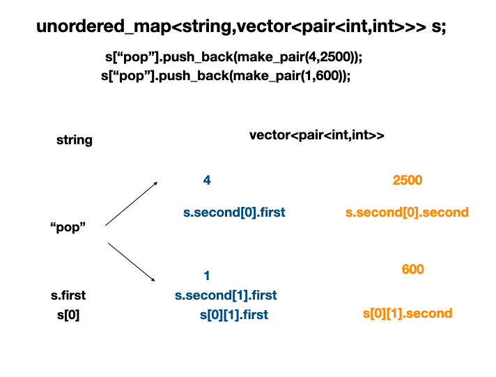

**Hash**

#### 완주하지 못한 선수
```c++
#include <string>
#include <vector>
#include <algorithm>

using namespace std;

string solution(vector<string> participant, vector<string> completion) {
    string answer = "";
    sort(participant.begin(),participant.end());
    sort(completion.begin(),completion.end());
    
    for(int i = 0; i < participant.size(); ++i){
        if(completion[i] == participant[i])
          continue;
        else{
            answer = participant[i];
            break;
        }
    }
    return answer;
}
```

#### 전화번호 목록  
```c++
#include <string>
#include <vector>
#include <unordered_map>

using namespace std;

bool solution(vector<string> phone_book) {
    bool answer = true;
    string str = "";
    unordered_map<string,int> d;
    
    for(auto& i: phone_book){
        str = "";
        for(int j = 0; j < i.size(); ++j){
            str += i[j];
            d[str]++;
            //이로써 d에는 phone_book 인덱스 외의 키도 갖게된다.
        }
    }
    
    for(auto& i: phone_book){
        //d가 아닌 phone_book인 이유 : d의 수많은 키 중에서 phone_book에 있는 키만 뽑아보겠다.
        if(d[i] > 1){
            answer = false;
            break;
        }
    }
    return answer;
}

```

#### 위장  
```c++
#include <string>
#include <vector>
#include <unordered_map>


using namespace std;

int solution(vector<vector<string>> clothes) {
    int answer = 1;
    unordered_map<string,int> d;

    for(auto& i: clothes){
        d[i[1]]++;
    }
    
    for(auto& i: d){
        answer *= i.second+1; //각 종류당 이름의 수
        //headgear_1,headgear_2,headgear_x & eyewear_1,eyewear_x ==> 3 * 2
    }
    return answer-1;
    //headgear_x,eyewear_x 경우의 수 제외
}

```
#### 베스트 앨범

unordered_map으로 구현함, 하지만 정렬을 위해 vector를 씀  
이미 정렬되어있는 map, set 활용하는 법 익혀야함  
```c++
#include <string>
#include <vector>
#include <unordered_map>
#include <iostream>
#include <algorithm>
using namespace std;

bool compare(pair<int,int> a,pair<int,int> b){
    //first : 고유번호, second : 재생횟수
    return a.second > b.second;
}
bool compare_map_value(pair<string,int> a,pair<string,int> b){
    //first : 장르, second : 총 재생횟수
    return a.second > b.second;
}
vector<int> solution(vector<string> genres, vector<int> plays) {
    vector<int> answer;
    /*
    i : 고유번호
     - genres[i] 고유번호 i의 장르 - plays[i] 고유번호 i의 재생 횟수
    1. 장르별 총 재생횟수를 구한다 (가장 많이 재생된 장르 찾기 위해 정렬 필)
    2. 같은 장르 안에서 재생순 1~2위를 구한다. 재생순위 동일시 고유번호 낮은 순 (각 장르당 최대 2곡만 선별, 재생횟수 정렬 필)
    */
    
    unordered_map <string,int> g_cnt;
    //장르별 총 재생횟수 담을 컨테이너 <"장르", 재생횟수>
    unordered_map<string,vector<pair<int,int>>> summary;
    //<"장르",재생횟수, 고유번호>

    for(int i=0; i < genres.size(); ++i){
        g_cnt[genres[i]] += plays[i];
        //d["classic"] = 500 + 150 + 800 
        summary[genres[i]].push_back(make_pair(i,plays[i]));
        //summary["classic"] -> (0,500) (2,150)....

    }
    for(auto &i : summary){
        sort(i.second.begin(),i.second.end(),compare); //같은 장르 안에서 재생 순위 내림차순 정렬
        // for(int j = 0; j < i.second.size(); ++j){
        //     cout << i.first << " " << i.second[j].first <<" "<< i.second[j].second <<endl;
        // }
    }
    
    vector<pair<string,int>> v_g_cnt;
    v_g_cnt.assign(g_cnt.begin(),g_cnt.end());
    sort(v_g_cnt.begin(),v_g_cnt.end(),compare_map_value); 
    // 장르별 총 재생횟수 내림차 정렬, 가장 큰 재생횟수를 가진 장르부터 담을거임

   for(int i = 0; i <v_g_cnt.size(); ++i){
    string g = v_g_cnt[i].first;
       for(int j = 0; j < summary[g].size() && j < 2; ++j){
            //cout << summary[g][j].second <<endl;
           answer.push_back(summary[g][j].first);
       }
    }

    return answer;
}
```  

**vector<pair> 구조 이해**  
  

#### 베스트 앨범(map,set ver.)

```c++
#include <string>
#include <vector>
#include <map>
#include <set>
#include <algorithm>
using namespace std;

vector<int> solution(vector<string> genres, vector<int> plays) {
    vector<int> answer;
    /*
    i : 고유번호
     - genres[i] 고유번호 i의 장르 - plays[i] 고유번호 i의 재생 횟수
    1. 장르별 총 재생횟수를 구한다 (가장 많이 재생된 장르 찾기 위해 정렬 필)
    2. 같은 장르 안에서 재생순 1~2위를 구한다. 재생순위 동일시 고유번호 낮은 순 (각 장르당 최대 2곡만 선별, 재생횟수 정렬 필)
    */

    map<string, map<int, set<int>, greater<int>>> list_map;
    //이중 map으로 내림차순 정렬구현, set : 중복없이 정렬
    //<"장르",<재생횟수,고유번호>>

    map<string, int> max;

    map<int, string, greater<int>> sort_max;
    
    int i = 0;
 
    for_each(genres.begin(), genres.end(), [&](string& s){  //데이터 분류 작업
        if(list_map.find(s) == list_map.end()){
            map<int, set<int>, greater<int>> m;  //plays 내림차순 정렬 
            set<int> index;
 
            index.insert(i);
            max.emplace(s, plays[i]);
            m.emplace(plays[i], index);
            list_map.emplace(s, m); 
        }else{
            map<int, set<int>, greater<int>>::iterator itr;
            if((itr = list_map[s].find(plays[i])) == list_map[s].end()){
                set<int> index;
                index.insert(i);
                list_map[s].emplace(plays[i], index);
                max[s] += plays[i]; 
            }else{
                itr->second.insert(i);
                max[s] += plays[i]; 
            }
        }
        i++;
    }); 
 
    for_each(max.begin(), max.end(), [&](pair<string, int> itr){    //max값 찾기
        sort_max.emplace(itr.second, itr.first);     
    });
 
    for_each(sort_max.begin(), sort_max.end(), [&](pair<int, string> s){    //검색
         map<int, set<int>, greater<int>>::iterator m = list_map[s.second].begin();
         set<int>::iterator itr = m->second.begin();;
         
         if(list_map[s.second].size() == 1){    //장르에 대한 재생횟수 종류가 1개일 경우
            answer.push_back(*itr);
            return;
         }
         
         for(int i = 0; i < 2; i++){        //각 장르당 2개만 찾으면 되므로
            if(m->second.size() > 1 && i == 0){        //plays가 중복될 경우(중복된 경우에 재생횟수가 가장 큰녀석만 해당됨)
                answer.push_back(*(itr++));
                answer.push_back(*(itr++));
                return;
            }
            answer.push_back(*itr);        //중복된것이 없다면 조건대로 검색
            itr = (++m)->second.begin();
         }
    });
    return answer;
}

``` 

