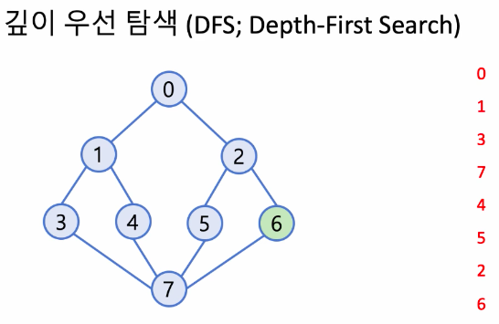

#### C++ Kit Part 7 : DFS|BFS / 여행경로  

##### 깊이 우선 탐색 (DFS: Depth-First Search)    
- 한 노드에서 인접한 모든(unvisited) 노드를 방문하되, 각 인접 노드를 기준으로 깊이 우선 탐색을 끝낸 후 다음 노드로 진행  

  

--> ***스택***을 이용해서 어느 노드에서 dfs 하고 있는지를 기억하고 되돌아가야함  


##### 너비 우선 탐색 (DFS: Breadth-First Search)    
- 한 정점에서 인접한 모든(unvisited) 노드를 방문하고, 방문한 각 인접 노드를 기준으로 **(방문한 순서에 따라)** 또 다시 너비 우선 탐색을 행함  

  

--> ***큐***을 이용해서 어느 노드에서 bfs 하고 있는지를 기록하고 진행함  


**solution**  
O(NlogN)  
깊이 우선 탐색을 응용해서 *한 붓 그리기!*  
시작점은 항상 ICN  
모든 정점(노드)방문이 아니라 모든 간선(에지)을 거쳐야한다.  
어차피 한 번은 가야하는데 그 순서를 정해라  
한 노드에서 택할 수 있는 엣지가 두개 이상이라면? 공항의 알파벳 순서대로  

**스택을 이용**하여 재귀적인 한 붓 그리기 문제를 해결한다.  
    

스택으로 관리하면서 탐색을 진행한다.  
(스택은 재귀성질에 용이하다.)   
탐색 종료 후 pop하면 그 순서의 역순이 방문한 공항의 순서다.     

**그래프를 코드로 표현하는 법**    
unordered_map을 이용해 각 공항에서 출발하는 항공권의 vector를 표현  

>key -> value  
ICN -> {ATL,SFO}   
ATL -> {ICN,SFO}   
SFO -> {ATL}

But, 스택은 LIFO! 알바펫 역순으로 정렬해 pop_back()을 이용한다.  
>key -> value  
ICN -> {SFO,ATL}   
ATL -> {SFO,ICN}   
SFO -> {ATL}

```c++
#include <string>
#include <vector>
#include <unordered_map>
#include <algorithm>

using namespace std;

vector<string> solution(vector<vector<string>> tickets){
	vector<string> answer;
	
	sort(tickets.begin(),tickets.end(),greater<vector<string>>()); //표를 역순 정렬
	//O(NlogN) N : # of tickets
	unordered_map<string,vector<string>> routes; //각 공항에서 출발하는 항공권의 집합 
	
	for(int i = 0; i < tickets.size(); ++i){ //map에 항공권을 할당한다.  
		routes[tickets[i][0]].push_back(tickets[i][1]);
		//시작점에서 출발할 수 있는 항공권들을 push_back()
	}

	vector<string> s = vector<string> {"ICN"}; //ICN부터 시작하는 스택

	while(!s.empty()){ //-> O(N)
		string airport = s.back(); //top of stack
		if(routes.find(airport) == routes.end() || routes[airport].size()== 0){
		//이 공항으로부터 출발하는 티켓이 없거나 이미 항공권을 사용하여 남은 티켓이 없는 경우

			//스택에서 꺼낸 후 기록한다.
			answer.push_back(airport);
			s.pop_back();
		}else{//출발하는 엣지 있음
			s.push_back(routes[airport].back()); //스택에 추가함, 이미 역순 정렬해서 제일 뒤에있는게 제일 빠른 알파벳
			routes[airport].pop_back(); //항공권을 사용했기에 pop해준다. 
		} 
	}
	reverse(answer.begin(),answer.end());
	return answer;
}
```

